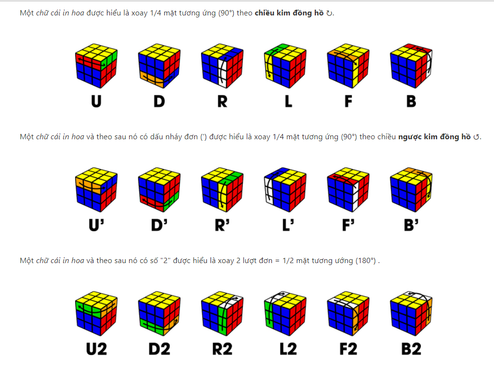
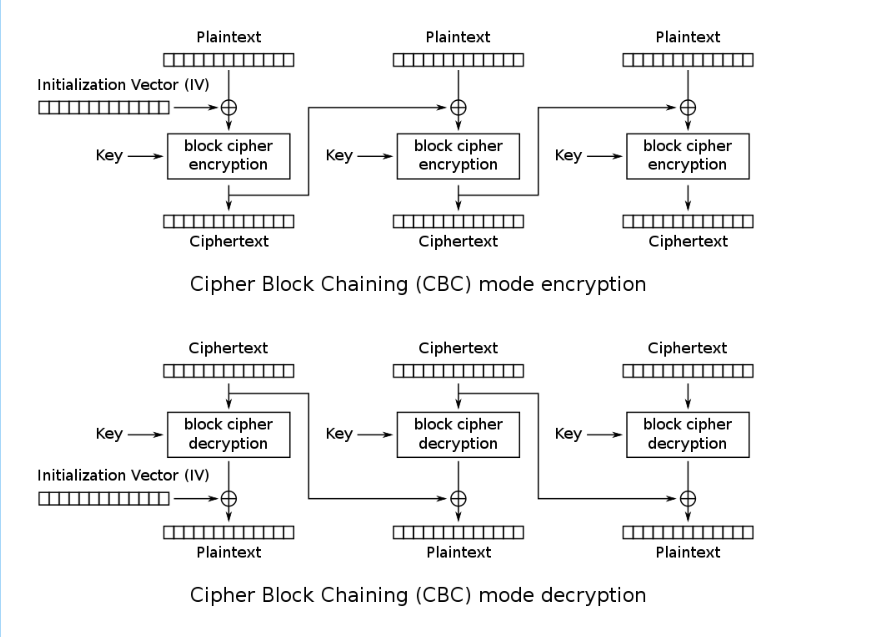

# rgbCTF2020

Giải này do mình không có nhiều thời gian nên không thể viết writeup hết tất cả các bài đã làm được, các bạn thông cảm nhé. Các file của mỗi bài mình để trong các thư mục mang các bài, các bạn có thể tải về và làm thử nhé

## [Beginner] Quirky Resolution

Chúng ta được cung cấp 1 file ảnh, mở ra thì chả có gì cả, mình thử sử dụng [LSB Tool](https://desudesutalk.github.io/lsbtools/) 


Ta thu được 1 QR code chứa flag

### flag: rgbCTF{th3_qu1rk!er_th3_b3tt3r}

## [Cryptography] RubikCBC
```
scramble "F" on block "OOOOOOOOOYYYWWWGGGBBBYYYWWWGGGBBBYYYWWWGGGBBBRRRRRRRRR" becomes "OOOOOOYYYYYRWWWOGGBBBYYRWWWOGGBBBYYRWWWOGGBBBGGGRRRRRR"

IV = "ABCDEFGHIJKLMNOPQRSTUVWXYZ[\\]^_`abcdefghijklmnopqrstuv"
SCRAMBLE = D R2 F2 D B2 D2 R2 B2 D L2 D' R D B L2 B' L' R' B' F2 R2 D R2 B2 R2 D L2 D2 F2 R2 F' D' B2 D' B U B' L R' D'
```
---------------------------------------------------------------------------------------------

Lúc đầu mới nhìn thì mình có lúng túng không biết nó mã hoá theo kiểu gì, nhưng nhìn vào tên của bài - mình đã được soi sáng! 
Nếu bây giờ mình viết plain text lên 1 con rubik rồi xoay nó theo 1 quy tắc nào đó, rồi sau đó chép lại các chữ cái trên con rubik của mình thì mình sẽ được 1 cipher text. Tương tự bài này, người ta sử dụng rubik để hoán vị các bytes 


Thuật toán mã hoá được thiết kế theo dạng Block cipher (mã hoá theo từng block) mode CBC. Chuỗi SCRAMBLE chính là các thao tác khi encrypt 1 block, mình chỉ cần đi ngược lại là xong.  Thật may mắn khi python có thư viện rubik.cube hỗ trợ mình giải bài này. Bây giờ code thôi!


```python
from rubik.cube import Cube
def tos(cube):			# chuyển rubik về string
    return "".join(str(cube).split())

def tran(f, c):		#thực hiện xoay rubik với chiều ngược lại, ví dụ truyền vào "F" thì nó sẽ thực hiện hành động "F'"
	if f == 'F':
		c.Fi()
	elif f == 'B':
		c.Bi()
	elif f == 'R':
		c.Ri()
	elif f == 'L':
		c.Li()
	elif f == 'U':
		c.Ui()
	elif f == 'D':
		c.Di()
	elif f == "F'":
		c.F()
	elif f == "B'":
		c.B()
	elif f == "R'":
		c.R()
	elif f == "L'":
		c.L()
	elif f == "U'":
		c.U()
	elif f == "D'":
		c.D()
	elif f == 'F2':
		c.Fi()
		c.Fi()
	elif f == 'B2':
		c.Bi()
		c.Bi()
	elif f == 'R2':
		c.Ri()
		c.Ri()
	elif f == 'L2':
		c.Li()
		c.Li()
	elif f == 'U2':
		c.Ui()
		c.Ui()
	elif f == 'D2':
		c.Di()
		c.Di()

def to_blocks(in_bytes: bytes) -> list:			# cắt cipher text thành các block 54 byte
	return [in_bytes[i:i + 54] for i in range(0, len(in_bytes), 54)]

def xor(a, b):		# xor 2 byte a và b với nhau
	out = b''
	for i in range(len(a)):
		out += bytes([int(a[i])^int(b[i])])
	return out
#lấy chuỗi SCRAMBLE đảo ngược
SCRAMBLE = "D R2 F2 D B2 D2 R2 B2 D L2 D' R D B L2 B' L' R' B' F2 R2 D R2 B2 R2 D L2 D2 F2 R2 F' D' B2 D' B U B' L R' D'"
SCRAMBLE = SCRAMBLE.split(' ')
s = []
for i in range(len(SCRAMBLE)-1,-1, -1):
	s += [s[i]]


#Chúng ta chỉ cần tìm quy luật hoán vị của mỗi block, rồi áp dụng nó nhiều lần
IV = "ABCDEFGHIJKLMNOPQRSTUVWXYZ[\\]^_`abcdefghijklmnopqrstuv"
c = Cube(IV)
for i in s:
	tran(i, c)
x = tos(c)
per = []		#mảng phần tử thứ i trong mảng per chứa vị trí của byte thứ i của plain text trong cipher text (với mỗi block)
for i in range(len(IV)):
	for j in range(len(IV)):
		if x[i] == IV[j]:
			per += [j]
# decrypt			
data = open('F:\Downloads\enc_', 'rb').read()
Cipher = to_blocks(data)
plain = b''

#decrypt block đầu tiên
c = bytearray(Cipher[0])
for i in range(len(Cipher[0])):
	plain += bytes([c[per[i]]])
plain = xor(bytes(IV, 'utf-8'), plain)

#decrypt các block còn lại
for i in range(1, len(Cipher)):
	c = bytearray(Cipher[i])
	d = b''
	for j in range(len(Cipher[i])):
		d += bytes([c[per[j]]])
	plain += xor(Cipher[i-1], d)

open('D:/save/tes', 'wb').write(plain)
```

Chúng ta có được 1 file PDF, nếu các bạn không đoán được định dạng file thì có thể sử dụng công cụ file hoặc binwalk trên linux để check nhé.
Trong file có 1 mã QR code, các bạn quét để nhận flag.
### flag: rgbCTF{!IP_over_Avian_Carriers_with_QoS!}


## [Cryptography] Adequate Encryption Standard
```
I wrote my own AES! Can you break it?

hQWYogqLXUO+rePyWkNlBlaAX47/2dCeLFMLrmPKcYRLYZgFuqRC7EtwX4DRtG31XY4az+yOvJJ/pwWR0/J9gg==
```
-----------------------------------------------
Chúng ta có một cipher text được encode với base64, thử xem code coi có gì nhé:

```python
def encrypt(plain: bytes, key: bytes) -> bytes:
    blocks = to_blocks(plain)
    out = bytearray()
    key = expand_key(key, len(blocks))
    for idx, block in enumerate(blocks):
        block = pad(block)
        assert len(block) == BLOCK_SIZE
        for _ in range(ROUNDS):
            block = enc_sub(block)
            block = enc_perm(block)
            block = bytearray(block)
            for i in range(len(block)):
                block[i] ^= key[idx]
        out.extend(block)
    return bytes(out)
```
Ở hàm encrypt ta thấy mỗi block được đi qua hàm enc_sub() (hàm thay thế byte), enc_perm() (hàm hoán vị các bit) và xor với 1 key (độ dài 1 byte) 8 lần (ROUNDS = 8). 
Dừng lại và suy nghĩ: tại sao mỗi block lại có 1 key với độ dài 1 byte???

Vì mỗi block, key chỉ có 1 byte nên mình quyết định brute force key của mỗi block!

Đầu tiên là viết hàm de_sub() và de_perm() để lấy chuỗi bytes trước khi vào hàm  enc_sub() và enc_perm()
```python
def de_sub(in_bytes: bytes) -> bytes:
    return bytes([sbox.index(b) for b in in_bytes ])

dpbox = []
for i in range(len(pbox)):
	for j in range(len(pbox)):
		if pbox[j] == i:
			dpbox += [j]
			break
      
def de_perm(in_bytes: bytes) -> bytes:
    num = int.from_bytes(in_bytes, 'big')
    binary = bin(num)[2:].rjust(BLOCK_SIZE * 8, '0')
    permuted = ''.join([binary[dpbox[i]] for i in range(BLOCK_SIZE * 8)])    # doi vi tri cac bit
    out = bytes([int(permuted[i:i + 8], 2) for i in range(0, BLOCK_SIZE * 8, 8)])   # chuyen lai ve byte
    return out
```
sau đó chạy brute froce thôi
```python
c = 'hQWYogqLXUO+rePyWkNlBlaAX47/2dCeLFMLrmPKcYRLYZgFuqRC7EtwX4DRtG31XY4az+yOvJJ/pwWR0/J9gg=='
c = b64decode(c)
blocks = to_blocks(c)
for i in range(8):
    for k in range(256):
        b = blocks[i]
        for _ in range(ROUNDS):
            b = bytearray(b)
            for j in range(len(b)):
                b[j] ^= k
            b = bytes(b)
            b = de_perm(b)
            b = de_sub(b)
        try:
            print(b.decode())
            print(i, k)
        except:
            continue

```
 ### flag: rgbCTF{brut3_f0rc3_is_4LW4YS_th3_4nsw3r(but_with_0ptimiz4ti0ns)}
